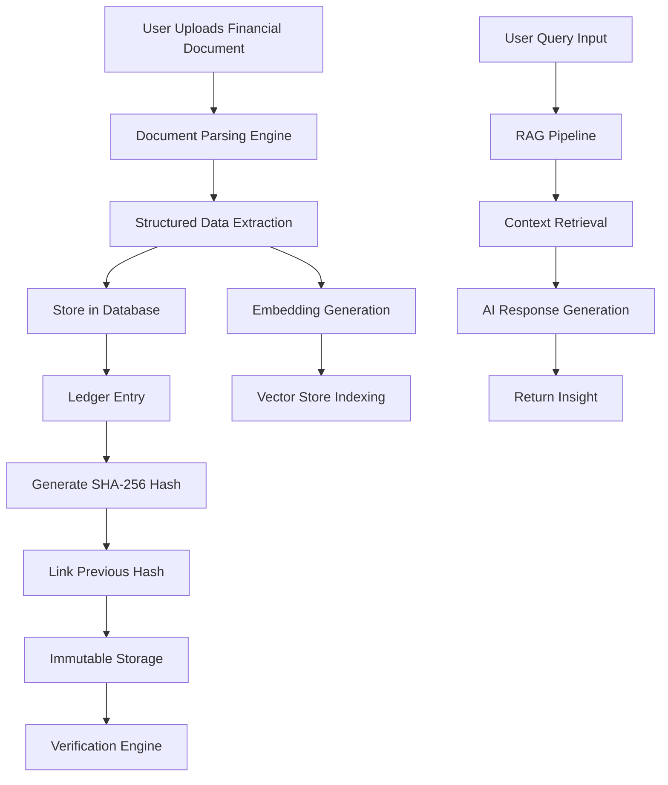
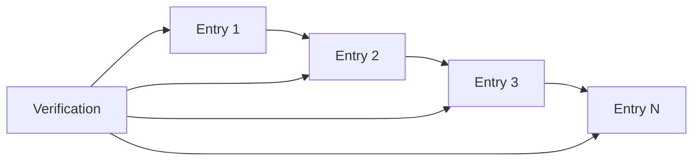

# 🔍 LedgerLens — AI Financial Intelligence Platform

LedgerLens is a full-stack, AI-powered financial intelligence and research platform designed to convert complex corporate filings and ledger data into structured, actionable insights.

It combines **Retrieval-Augmented Generation (RAG)** for intelligent querying with **cryptographic hash chaining** to ensure data integrity.

---

## 🚀 Links

- 💻 Repository  
https://github.com/rishabh1230/LedgerLens  

---

## 🧠 Core Idea

> Transform unstructured financial data into verifiable, queryable intelligence.

---

## ⚙️ System Flowchart



---

## 🚀 Features

- Intelligent document parsing  
- RAG-based natural language querying  
- SHA-256 tamper-evident ledger  
- Real-time verification system  
- Interactive dashboard  

---

## 🧩 Tech Stack

**Frontend**
- React.js
- TypeScript
- Tailwind CSS

**Backend**
- FastAPI
- SQLModel / SQLAlchemy

**Database**
- SQLite / PostgreSQL

**AI**
- Gemini AI
- LangChain

**DevOps**
- Docker
- GitHub Actions

---

## 📦 Installation

### Backend

```bash
cd backend
python -m venv venv
source venv/bin/activate
pip install -r requirements.txt
uvicorn main:app --reload
```

### Frontend

```bash
cd frontend
npm install
npm run dev
```

---

## 🐳 Docker

```bash
docker-compose up --build
```

---

## 🧪 Testing

```bash
cd backend
pytest
```

---

## 🔐 Hash Chain Flow



---

## 👨‍💻 Author

Rishabh Pandey
